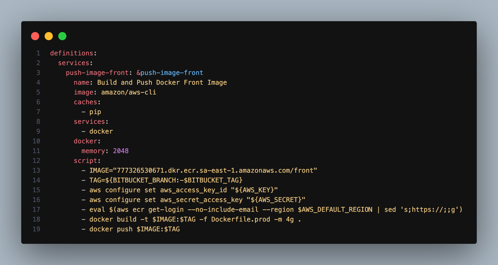
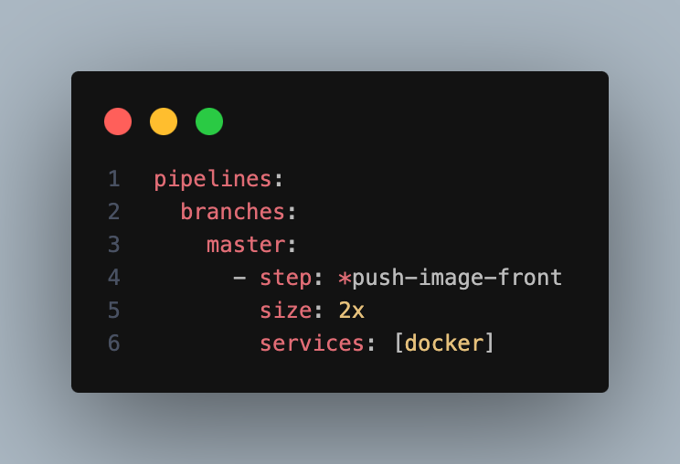
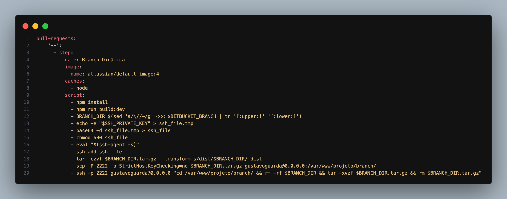

# Project CI/CD Pipeline

This repository uses Bitbucket Pipelines for Continuous Integration and Continuous Deployment (CI/CD). The pipeline builds and pushes Docker images and manages dynamic branches for development.

## Table of Contents

- [Pipeline Overview](#pipeline-overview)
- [Pipeline Configuration](#pipeline-configuration)
  - [Definitions](#definitions)
  - [Pipelines](#pipelines)
    - [Branches](#branches)
    - [Pull Requests](#pull-requests)
- [Environment Variables](#environment-variables)
- [Nginx Configuration](#nginx-configuration)
- [Prerequisites](#prerequisites)

## Pipeline Overview

The CI/CD pipeline is designed to automate the build and deployment processes, ensuring that the application is consistently built, tested, and deployed across different environments. The pipeline has two main sections:
1. **Branches**: Executes the pipeline when code is pushed to the `master` branch.
2. **Pull Requests**: Executes the pipeline for any pull requests, managing dynamic branches for development.

## Pipeline Configuration

### Definitions

The `definitions` section defines reusable steps for the pipeline.



### Pipelines

The pipelines section defines the triggers and steps for different events.

### Branches

For the master branch, the pipeline builds and pushes a Docker image to the AWS ECR repository.



### Pull Requests

For any pull request, the pipeline builds the project in development mode and transfers the built files to a remote server, creating a dynamic directory based on the branch name.



### Environment Variables

Ensure the following environment variables are set in your Bitbucket repository settings:

- AWS_KEY: AWS Access Key ID.
- AWS_SECRET: AWS Secret Access Key.
- AWS_DEFAULT_REGION: AWS Region (e.g., sa-east-1).
- SSH_PRIVATE_KEY: Base64-encoded SSH private key for accessing the remote server.

### Nginx Configuration

To serve the dynamically created branches, add the following configuration to your Nginx server block:

```nginx
location /branch {
    root /var/www/mart-front/;
    index index.html;
    try_files $uri $uri/ /index.html;
}
```

This configuration sets up Nginx to serve files from the /var/www/mart-front/ directory for any requests to /branch, falling back to index.html for single-page application (SPA) routing.

### Prerequisites

- Bitbucket account with Pipelines enabled.
- AWS account with ECR repository created.
- Remote server with SSH access configured.
- Nginx server properly set up to serve your application.

### Conclusion

This CI/CD pipeline ensures that your application is built, tested, and deployed efficiently. Feel free to customize the pipeline configuration to fit your project’s specific requirements.